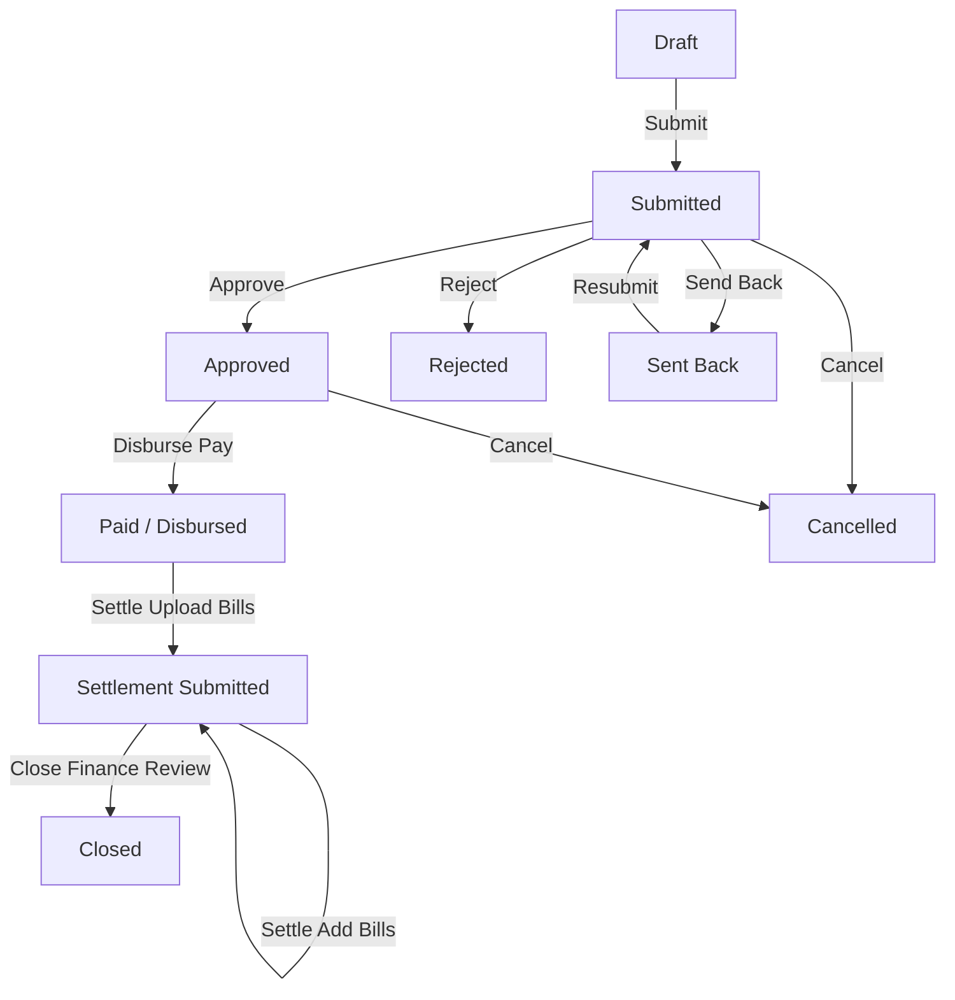

# 💰 PETTY CASH MODULE - COMPLETE TECHNICAL & WORKFLOW ANALYSIS

## Executive Summary
The **Petty Cash Requisition & Settlement Module** manages minor operational cash floats, site reimbursements, bill settlements, and financial ledger reconciliation across properties.

---

## 1. Accessible Accounts & Access Matrix

Access is controlled via `backend/lib/pettyCash/access.ts` (evaluated dynamically at the API layer based on user organization and property memberships):

User Role | Accessible Tabs | Actions Allowed
:--- | :--- | :---
**Org Super Admin / Org Admin / Ops Super Admin / Master Admin** | Mine, Approvals, Disbursements, All, Tracker | Full Org visibility, Approve/Reject/Send Back, Disburse, Review Bills, Close, Cancel
**Property Admin / Site Manager / Manager Executive / Soft Service Manager** | Mine, Approvals, All (Property Scoped), Tracker | Property visibility, Approve/Reject/Send Back for their property, Raise requests
**Finance / Accounts (`accounts` role)** | Mine, Disbursements, All, Tracker | Disburse cash (`paid`), Review settlement bills (`accepted`/`rejected`), Close float (`closed`)
**Ground Staff / MST / Technicians / Site Users** | Mine, Create Modal, Settlement Drawer | Raise requests for their property, Upload settlement bills, Resubmit sent-back requests
**Tenants / Tenant Users / Super Tenants / Vendors** | ❌ **No Access** (`Forbidden: no petty cash access`) | Blocked from viewing or creating petty cash

---

## 2. Who Can Raise Petty Cash & What Happens During Raising

### Who Can Raise:
- Any active member of an organization whose role is **NOT tenant-like** (Staff, Property Admins, Managers, Accounts, Org Admins).
- Non-admin requesters can only file requests for properties where they hold active membership.

### What the Requester Does While Raising:
1. **Select Request Type**:
   - **`advance`**: Cash float requested up front before spending.
   - **`reimbursement`**: Claiming expenses already paid out of pocket.
2. **Fill Details**: Property, Category (*Housekeeping, Repairs, Fuel, Refreshments, Supplies, Emergency, Maintenance, Miscellaneous*), Department, Amount Requested, Purpose, Preferred Payment Mode (*Cash, UPI, Bank Transfer*), Expected Date.
3. **Custodian Identification (`recipient_name`, `recipient_phone`)**:
   - Captures who physically receives and spends the cash. Defaults to the requester, but can be overridden (e.g., a Site Supervisor raising a float for a ground technician).
4. **Attach Initial Documents**: Upload quotes or estimates (`stage: 'request'`).
5. **Open-Advance Gate Check**:
   - If the requester has open unaccounted advances (`is_open_advance = true`), the API checks `petty_cash_settlement_status` and prompts a warning (`open_advance_outstanding`). The requester must explicitly acknowledge open floats (`acknowledge_open_advances: true`) to submit.

---

## 3. Approvals & Lifecycle Transitions

The state machine is defined in `backend/lib/pettyCash/transitions.ts`:



- **`approve`**: Approver sets `status = 'approved'`, records `approver_id`, `approved_at`, optional `approved_amount`, and remarks.
- **`reject`**: Requires mandatory rejection remarks; status becomes `rejected`.
- **`send_back`**: Status becomes `sent_back`. Requester can edit amount/purpose and click **`resubmit`**.
- **`pay` (Disbursement)**: Performed by Finance (`accounts` / Admins). Sets `status = 'paid'`, records `paid_amount`, `paid_at`, `paid_mode`, and `payment_ref`.
- **`settle`**: Requester uploads bills (`stage: 'settlement'`), specifies `actual_spent`, `amount_returned`, `extra_claimed`. Status becomes `settlement_submitted`.
- **`close`**: Performed by Finance after reviewing settlement bills. Status becomes `closed`.

---

## 4. Database Schema & Architecture

### Key Tables (`supabase/migrations/20260723000002_petty_cash.sql` & `20260903000001_petty_cash_ledger.sql`)

1. **`petty_cash_requests`**:
   - `id`, `request_no` (Auto-generated: `PCR-00042` via sequence `petty_cash_request_seq`)
   - `organization_id`, `property_id`, `requester_id`
   - `recipient_name`, `recipient_phone` (Custodian who holds cash)
   - `request_type` (`advance` | `reimbursement`), `amount_requested`, `approved_amount`, `paid_amount`
   - `status` (`draft`, `submitted`, `approved`, `rejected`, `sent_back`, `paid`, `settlement_submitted`, `closed`, `cancelled`)
   - `paid_by`, `paid_at`, `paid_mode`, `payment_ref`
   - `actual_spent`, `amount_returned`, `extra_claimed`, `settled_at`
   - `closed_by`, `closed_at`, `close_remarks`

2. **`petty_cash_documents`**:
   - `request_id`, `stage` (`request` | `settlement`)
   - `file_url`, `file_name`, `file_type`, `uploaded_by`
   - **Ledger Fields**: `amount` (Bill value), `bill_date`, `vendor`, `review_status` (`pending` | `accepted` | `rejected`), `reviewed_by`, `reviewed_at`, `review_remarks`

3. **`petty_cash_activity`**:
   - Audit trail tracking every transition (`actor_id`, `action`, `from_status`, `to_status`, `remark`, `created_at`).

4. **`petty_cash_settlement_status` (SQL View)**:
   - Computes:
     - `disbursed`: Amount paid out of till.
     - `bills_total`: Sum of non-rejected settlement bills.
     - `amount_returned`: Physical cash returned to till.
     - `accounted`: `bills_total + amount_returned`.
     - `unaccounted`: `disbursed - accounted`.
     - `accounted_pct`: `(accounted / disbursed) * 100`.
     - `is_open_advance`: `TRUE` while `status IN ('paid', 'settlement_submitted')`.
     - `days_outstanding`: Days elapsed since `paid_at`.

---

## 5. What is Missing / What is Not Working Perfectly (Gaps & Defects Identified)

1. **Document Review UI in Drawer (`RequestDetailDrawer.tsx`)**: ✅ **RESOLVED**
   - *Implementation*: Added interactive `✓ Accept` and `✕ Reject` action buttons with status indicators (`Accepted`, `Rejected: <reason>`, `Pending Review`) inside [`RequestDetailDrawer.tsx`](file:///d:/Projects/saas_one/frontend/components/pettyCash/RequestDetailDrawer.tsx). When Finance clicks Accept or Reject, the API calculates the updated reconciliation, and the accounted % updates dynamically.
2. **Cash-Box / Vault Balance Ledger**:
   - *Issue*: The module tracks individual request floats, but does not maintain a running property physical cash-box opening/closing balance ledger (noted as out-of-scope in PRD §8.2).
3. **GST / ITC Invoice Breakdown**:
   - *Issue*: Bill details currently store `amount`, `bill_date`, and `vendor`, but do not break down GSTIN or Tax ITC components.
4. **Single-tier Approval Slab**:
   - *Issue*: All amounts follow a single approval step regardless of threshold (e.g. ₹2,000 vs ₹1,000,000 use the same 1-tier approver requirement).

---

## 6. Complete End-to-End Petty Cash Workflow

```text
[ Requester ] ---> Fills Form & Custodian Info ---> [ Open Advance Check ]
                                                            │
                                                            ▼
                                                    Creates Request (PCR-XXXXX)
                                                            │
                                                            ▼
                                                    Status: SUBMITTED
                                                            │
                                    ┌───────────────────────┴───────────────────────┐
                                    ▼                                               ▼
                              [ Approver ]                                    [ Approver ]
                             Approve Request                                 Send Back / Reject
                                    │                                               │
                                    ▼                                               ▼
                             Status: APPROVED                                Status: SENT_BACK
                                    │                                   (Requester edits & resubmits)
                                    ▼
                               [ Finance ]
                        Disburse Cash (Paid via UPI/Cash)
                                    │
                                    ▼
                             Status: PAID
                     (Advance is now OPEN & Tracked)
                                    │
                                    ▼
                              [ Custodian ]
                   Spends Cash & Uploads Settlement Bills
                                    │
                                    ▼
                       Status: SETTLEMENT_SUBMITTED
                                    │
                                    ▼
                               [ Finance ]
                     Reviews Bills & Confirms Accounted %
                                    │
                                    ▼
                              Status: CLOSED
```
